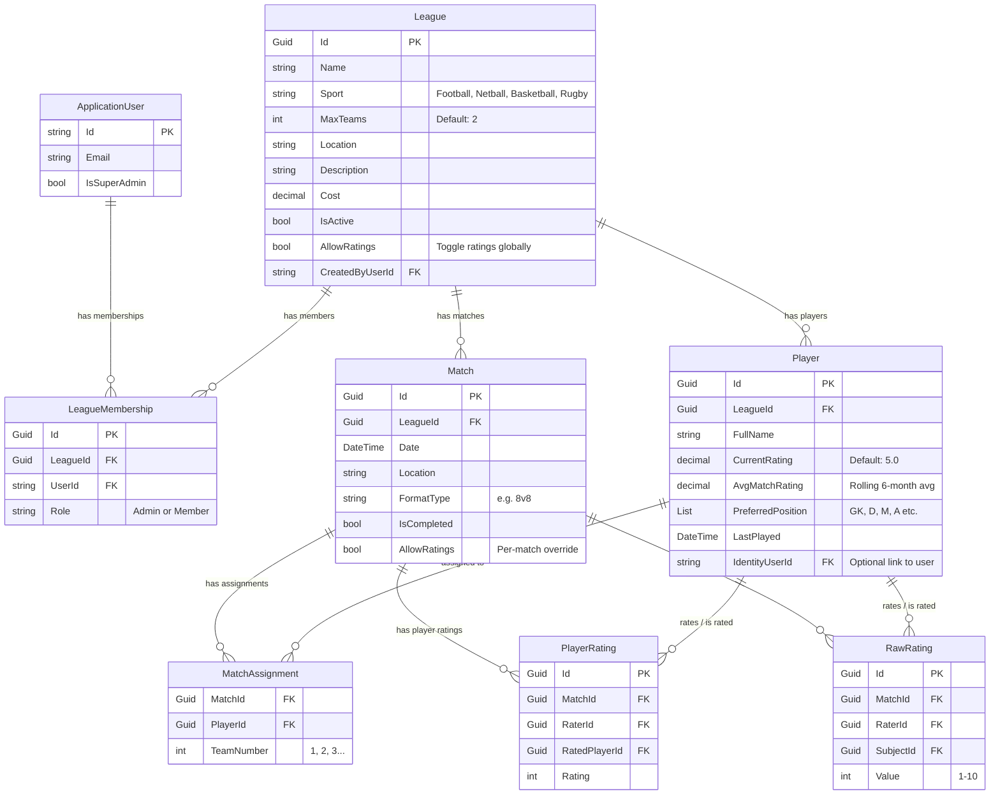

# EvenPlay — Sport Team Management & League Platform

> **Repository**: `Dannyj1984/match-manager`
> **Production URL**: `https://evenplay.app`
> **Package name**: `evenplay`

## Overview

EvenPlay is a multi-sport team management and league platform. It allows league administrators to organise pickup/casual matches, manage player rosters, and — crucially — **automatically generate balanced teams** using an algorithm that considers each player's preferred positions and ability ratings.

The platform currently supports **Football, Netball, Basketball, and Rugby**, with sport-specific positions used for team balancing.

---

## Tech Stack

| Layer | Technology |
|-------|-----------|
| **Backend API** | .NET 8 (C#) — `FairPlay.Api` |
| **Database** | PostgreSQL 16 |
| **Auth** | ASP.NET Identity + JWT Bearer tokens |
| **Frontend** | Nuxt 3 (Vue 3) + Tailwind CSS |
| **Icons** | Lucide Vue Next |
| **Dev Runner** | `concurrently` — `npm run dev` starts both backend & frontend |
| **Deployment** | Docker Compose → AWS Lightsail with Nginx reverse proxy |

---

## Project Structure

```
footy/
├── backend/                    # .NET 8 Web API (FairPlay.Api)
│   ├── Controllers/
│   │   ├── AuthController.cs       # Register, Login, Me, Change Password
│   │   ├── LeaguesController.cs    # League CRUD, membership & admin management
│   │   ├── MatchesController.cs    # Match lifecycle, team calc, ratings, dashboard
│   │   ├── PlayersController.cs    # Player CRUD, stats, rating updates
│   │   ├── LeaderboardController.cs# Timeframe-filtered leaderboard
│   │   ├── RatingsController.cs    # Rating utilities
│   │   └── DebugController.cs      # Dev-only debug endpoints
│   ├── Models/                     # Entity models (see Data Model below)
│   ├── Services/
│   │   ├── TeamBalancerService.cs  # ★ Core team-balancing algorithm
│   │   └── MatchRatingService.cs   # Peer rating processing & averages
│   ├── Data/
│   │   ├── FairPlayDbContext.cs    # EF Core DbContext
│   │   ├── DataSeeder.cs           # Initial seed data
│   │   └── Migrations/            # EF Core migrations
│   ├── Middleware/                 # Custom middleware (league context, etc.)
│   ├── DTOs/                       # Data transfer objects
│   └── Program.cs                  # App startup & configuration
│
├── frontend/                   # Nuxt 3 SPA
│   ├── pages/
│   │   ├── index.vue               # Dashboard (recent/next match, performance chart)
│   │   ├── login.vue               # Authentication page
│   │   ├── players.vue             # Player list with search, badges, rating controls
│   │   ├── leaderboard.vue         # Rating leaderboard with timeframe filters
│   │   ├── profile.vue             # User profile & settings
│   │   ├── match/setup.vue         # Match setup — player selection & team generation
│   │   └── leagues/
│   │       ├── index.vue           # League list & creation
│   │       └── [id].vue            # League detail & settings
│   ├── components/
│   │   ├── BottomNav.vue           # Mobile bottom navigation bar
│   │   ├── LeagueSelector.vue      # League switcher dropdown
│   │   ├── PlayerCard.vue          # Player display card
│   │   ├── PlayerCreateModal.vue   # Create player form modal
│   │   ├── PlayerRatingModal.vue   # Rate players after a match
│   │   ├── PlayerSelectSidebar.vue # Sidebar for selecting match participants
│   │   ├── RatingSlider.vue        # Interactive rating input slider
│   │   ├── TeamColumn.vue          # Team display column (after balancing)
│   │   └── Modal.vue               # Reusable modal component
│   ├── composables/
│   │   ├── useApi.ts               # Base API fetch helper
│   │   ├── useLeague.ts            # League state management & API calls
│   │   ├── useModal.ts             # Modal open/close state
│   │   └── useSportPositions.ts    # Sport-specific position lists
│   ├── middleware/
│   │   ├── auth.ts                 # Authenticated routes guard
│   │   ├── guest-only.ts           # Unauthenticated routes guard
│   │   ├── league.ts               # Ensure league is selected
│   │   └── member.ts               # Ensure user is league member
│   └── stores/
│       └── match.ts                # Pinia store for match state
│
├── docker-compose.yml          # Local dev (DB only)
├── docker-compose.prod.yml     # Production (DB + Backend + Frontend)
├── deploy.sh                   # Deployment script
└── package.json                # Root monorepo scripts
```

---

## Data Model



---

## Core Features

### 1. League Management
- **Super Admins** can create new leagues (choosing sport, max teams, location, cost)
- **League Admins** can update league settings, manage members, and create admin accounts
- Members are invited by email; roles are `Admin` or `Member`
- Users can belong to multiple leagues and switch between them via the `LeagueSelector`
- League context is passed via `X-League-Id` header on API requests

### 2. Player Management
- Players are created per league with a name, preferred positions, and a base rating (default 5.0)
- Players can optionally be linked to an `ApplicationUser` (identity account)
- Admins can update player ratings directly from the players page
- **Player Badges** are displayed on the players page:
  - 🥇 **Golden Boot** — highest average match rating
  - 🌅 **Early Bird** — first to register for matches
  - 🎮 **Games Played** — most matches played
  - 🔥 **Streak** — longest consecutive attendance

### 3. Match Lifecycle
The typical flow for a match is:

1. **Create Match** → Admin sets date, location, format (e.g. `5v5`, `8v8`, `11v11`)
2. **Player Selection** → Players toggle participation via the sidebar; admin can also select/deselect
3. **Generate Teams** → The team balancing algorithm is run (see below)
4. **Play the Match** → Teams are displayed in columns
5. **Complete Match** → Admin marks the match as completed
6. **Rate Players** → Participants submit peer ratings (1–10) for teammates/opponents
7. **View Results** → Match becomes read-only; ratings feed into leaderboard

### 4. ★ Team Balancing Algorithm (`TeamBalancerService`)
The algorithm uses a **two-phase approach**:

**Phase 1 — Position-Based "Pot" System**
- Iterates through each position for the sport (e.g. Goalkeeper → Defender → Midfielder → Forward)
- For each position, creates a **pot of candidates**: players whose preferred positions include that position
- **Specialists first**: Players who *only* play that position are prioritised (single-position players)
- Within each pot, players are sorted by rating (strongest first)
- Each player is assigned to the team with: (1) fewest players first, then (2) lowest total rating
- This ensures every team gets a goalkeeper, a defender, etc., before anyone gets two

**Phase 2 — Remaining Players**
- Any players not assigned in Phase 1 (multi-position players who weren't needed)
- Sorted by rating (strongest first)
- Assigned using the same team-selection logic: smallest team first, then lowest rating

**Result**: Teams that are balanced both in terms of **positional coverage** and **overall skill level**.

### 5. Player Ratings System
- After a match is completed, participants can rate each other (1–10 scale)
- Ratings are peer-to-peer — each player rates every other participant
- `MatchRatingService` saves ratings and recalculates rolling averages
- `AvgMatchRating` on the `Player` model is a **6-month rolling average** of all match ratings received
- Admins can also set a player's `CurrentRating` directly (the base rating used for team balancing)
- Ratings can be **disabled** at the league level (`AllowRatings`) or per-match (`Match.AllowRatings`)

### 6. Leaderboard
- Shows players ranked by **average rating** from peer reviews
- **Minimum 3 matches** required to appear (prevents one-match outliers)
- **Timeframe filters**: All time, 3 months, 6 months, 12 months
- Displays: rank, name, average rating, matches played, highest single rating

### 7. Dashboard
- Shows the authenticated user's personalised view for their current league:
  - **Most Recent Match** — link to the last completed match
  - **Next Active Match** — link to the next upcoming/open match
  - **Recent Performance** — bar chart of their last 4 match ratings
  - **Pending Ratings** — prompt if they haven't rated a completed match yet
  - **Quick Navigation** — links to All Players, Leaderboard

---

## Authentication & Roles

| Role | Scope | Capabilities |
|------|-------|-------------|
| **Super Admin** | Global | Create leagues, manage all leagues, promote/demote admins |
| **League Admin** | Per-league | Create matches, manage players, manage members, update league settings, mark matches complete |
| **Member** | Per-league | View matches, toggle own participation, submit ratings, view leaderboard |

- Auth uses **ASP.NET Identity** with **JWT Bearer tokens** (3-hour expiry)
- JWT claims include `userId`, `playerId`, `isSuperAdmin`, and roles
- Frontend stores token and uses `useAuth()` composable
- Route guards via Nuxt middleware: `auth.ts`, `guest-only.ts`, `league.ts`, `member.ts`

---

## API Endpoints Summary

### Auth (`/api/auth`)
| Method | Route | Description |
|--------|-------|-------------|
| POST | `/register` | Create new account |
| POST | `/login` | Get JWT token |
| GET | `/me` | Get current user info |
| POST | `/change-password` | Change password |

### Leagues (`/api/leagues`)
| Method | Route | Description |
|--------|-------|-------------|
| GET | `/` | List user's leagues |
| GET | `/{id}` | Get league details |
| POST | `/` | Create league (Super Admin) |
| PUT | `/{id}` | Update league (Admin) |
| DELETE | `/{id}` | Soft-delete league (Super Admin) |
| GET | `/{id}/members` | List members |
| POST | `/{id}/members` | Add member by email |
| DELETE | `/{id}/members/{userId}` | Remove member |
| POST | `/{id}/admins/{userId}` | Promote to admin |
| DELETE | `/{id}/admins/{userId}` | Demote admin |
| POST | `/{id}/create-admin` | Create new admin account |

### Matches (`/api/matches`)
| Method | Route | Description |
|--------|-------|-------------|
| POST | `/` | Create new match |
| GET | `/{id}` | Get match details |
| GET | `/by-date?date=` | Get match by date |
| GET | `/dashboard` | Get user dashboard data |
| POST | `/calculate-teams` | Run team balancing algorithm |
| POST | `/{id}/complete` | Mark match as completed |
| POST | `/{id}/toggle` | Toggle player participation |
| POST | `/{id}/ratings` | Submit peer ratings |
| GET | `/{id}/my-ratings` | Get user's submitted ratings |
| GET | `/{id}/can-rate` | Check if user can rate |
| GET | `/max-players` | Get max players for format |

### Players (`/api/players`)
| Method | Route | Description |
|--------|-------|-------------|
| GET | `/` | List league players (with stats/badges) |
| GET | `/me` | Get current player profile |
| PUT | `/me` | Update own profile |
| POST | `/` | Create player (Admin) |
| POST | `/{id}/promote` | Promote to admin |
| POST | `/{id}/demote` | Demote from admin |
| PUT | `/{id}/rating` | Update player rating (Admin) |
| GET | `/{id}/stats` | Get player statistics |
| DELETE | `/{id}` | Delete player (Admin) |

### Leaderboard (`/api/leaderboard`)
| Method | Route | Description |
|--------|-------|-------------|
| GET | `/?timeframe=` | Get leaderboard (all, 3m, 6m, 12m) |

---

## Supported Sports & Positions

| Sport | Positions |
|-------|-----------|
| **Football** | Goalkeeper, Defender, Midfielder, Forward |
| **Netball** | GK, GD, WD, C, WA, GA, GS |
| **Basketball** | Point Guard, Shooting Guard, Small Forward, Power Forward, Center |
| **Rugby** | Prop, Hooker, Lock, Flanker, Number 8, Scrum-half, Fly-half, Centre, Winger, Fullback |

---

## Running Locally

```bash
# 1. Start PostgreSQL via Docker
npm run db:up

# 2. Start both backend (.NET) and frontend (Nuxt) concurrently
npm run dev

# Backend runs on port 5137 (dev)
# Frontend runs on port 3000 with Nitro proxy forwarding /api/** to backend
```

---

## Deployment

Production uses Docker Compose (`docker-compose.prod.yml`) with three services:
- **db** — PostgreSQL 16 Alpine
- **backend** — .NET 8 API (port 5000 internally)
- **frontend** — Nuxt 3 SSR (port 80 internally, Nitro proxies `/api/**` to backend)

Deployed to **AWS Lightsail** behind an **Nginx reverse proxy** (`nginx-proxy-net` external network).
